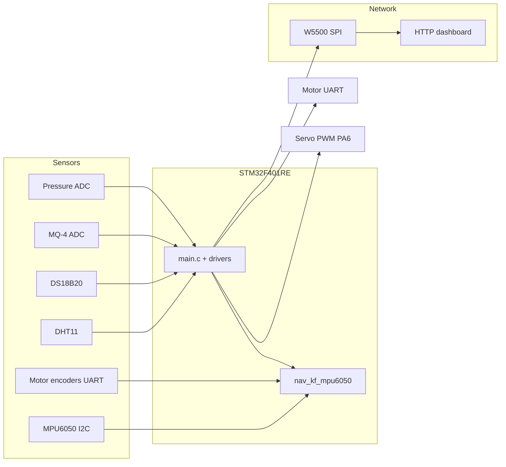

# STM32 Pipe Inspection Robot

[](https://www.st.com/en/microcontrollers-microprocessors/stm32f401re.html)
[](LICENSE)
[](Core/Src/main.c)

Firmware for an **in-pipe inspection robot**: four-motor drive, multi-sensor monitoring, **encoder + IMU odometry**, and a **live HTTP dashboard** over Ethernet (W5500).

| | |
|---|---|
| **MCU** | STM32F401RE (Nucleo-F401RE) |
| **Toolchain** | STM32CubeIDE · STM32 HAL · C |
| **Repo** | [github.com/arha55vi1802/stm32-pipe-inspection-robot](https://github.com/arha55vi1802/stm32-pipe-inspection-robot) |

---

## Highlights

- **Distance odometry:** encoder-led fusion with a 2-state Kalman filter; validated **~1.56 m** travel → **~1.60 m** on dashboard (**~2.6% error**)
- **IMU (MPU6050):** calibration, ZUPT when robot is still, dashboard accel/gyro and velocity estimate
- **Environmental sensing:** DHT11, DS18B20, MQ-4 (ADC + filter), MPXV7002DP pressure with zero/alert logic
- **Connectivity:** W5500 SPI Ethernet, embedded HTTP server (port 80)
- **Actuation:** Yahboom 4-motor UART driver (`$spd`, `$MAll` encoders); continuous rotation servo on TIM3 PWM

---

## Gallery

> Add screenshots to `docs/images/` then they appear here on GitHub.

| Dashboard | Hardware |
|-----------|----------|
| *`docs/images/dashboard.png`* | *`docs/images/hardware.png`* |

---

## System overview



**Fusion (honest scope):** distance is **encoder-primary**; the Kalman filter fuses encoder increments with IMU-assisted **zero-velocity updates** when stationary—not full SLAM or GPS-style localization.

---

## Features

| Module | Role |
|--------|------|
| **Motors** | Yahboom driver over USART1 — speed commands and `$MAll` encoder frames |
| **Odometry** | `nav_kf_mpu6050.c` — states: distance (m), velocity (m/s) |
| **DHT11** | Humidity & temperature (bit-bang GPIO driver) |
| **DS18B20** | Temperature (1-Wire via USART6) |
| **MQ-4** | Gas level — ADC + moving average |
| **MPXV7002DP** | Differential pressure — ADC, offset zero, inspection alerts |
| **MPU6050** | I2C IMU — calibration, dashboard, ZUPT in fusion |
| **W5500** | SPI2 Ethernet — HTTP server, motor/servo/calibration URLs |
| **Servo** | TIM3 CH1 (PA6), 50 Hz PWM — stop at 90° |

---

## Hardware connections (summary)

| Function | Interface | Pin / peripheral |
|----------|-----------|------------------|
| Motors | USART1 | Yahboom driver |
| Ethernet | SPI2 | W5500 |
| IMU | I2C1 | MPU6050 |
| DHT11 | GPIO | PA1 |
| Gas / pressure | ADC | MQ4 CH0, MPXV CH7 |
| Servo PWM | TIM3 CH1 | PA6 |
| DS18B20 | USART6 | PC6 |

Full pinout: open `Motor_4_integration.ioc` in STM32CubeMX / CubeIDE.

---

## Project layout

```
Core/Src/main.c              Main loop, HTTP dashboard, motors, sensor cache
Core/Src/nav_kf_mpu6050.c    MPU6050 + Kalman odometry
Core/Src/dht11_driver.c      DHT11
Core/Src/ds18b20.c           DS18B20
Drivers/Ethernet_W5500/      W5500 stack + wizchip port
Motor_4_integration.ioc      CubeMX clocks & pins
docs/images/                 Portfolio screenshots (you add PNG/JPG)
```

---

## Build & flash

1. Clone this repository.
2. Open the project folder in **STM32CubeIDE** (`.project` / `.cproject` included).
3. **Project → Build All**.
4. Connect Nucleo-F401RE via USB, then **Run** or **Debug**.

Build output (`Debug/`, `Release/`) is gitignored — generated locally after build.

---

## Dashboard

**Wiring:** PC Ethernet ↔ W5500 (direct cable, link-local).

| Setting | Value |
|---------|--------|
| Board IP | `169.254.52.10` |
| Subnet | `255.255.0.0` (typical for 169.254.x.x) |
| PC IP example | `169.254.52.100` (same subnet) |
| Browser | `http://169.254.52.10/` |

Configured in `Drivers/Ethernet_W5500/wizchip_port.c`.

**Useful HTTP actions:**

| URL | Action |
|-----|--------|
| `/` | Live dashboard |
| `/?enc_zero=1` | Zero encoders |
| `/?pressure_zero=1` | Re-zero pressure |
| `/?motor=stop` | Stop motors |
| `/?servo=90` | Servo stop (neutral) |

---

## Skills demonstrated

STM32 HAL · ADC · I2C · SPI · UART · PWM · custom sensor drivers · digital filtering · Kalman-style sensor fusion · embedded HTTP · real-time embedded C

---

## Author

**Arshman Hassan** — Embedded systems / robotics firmware

- GitHub: [@arha55vi1802](https://github.com/arha55vi1802)
- Project: [stm32-pipe-inspection-robot](https://github.com/arha55vi1802/stm32-pipe-inspection-robot)
- Email: *(add your professional email when ready)*
- Demo video: *(add YouTube/Drive link when recorded)*

Freelance gig text (Fiverr/Upwork): see `docs/FIVERR_GIG_COPY_PASTE.txt`.

---

## License

MIT — see [LICENSE](LICENSE). STM32 HAL/CMSIS remain under ST license terms.
